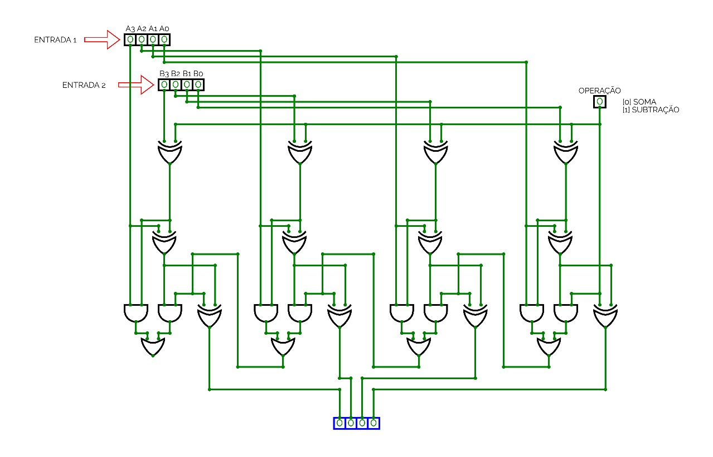

# Somador e Subtrator Completo

📘 **Descrição do Projeto**  
Para o projeto de grau A da minha disciplina de **Sistemas Digitais**, tive a tarefa de projetar e implementar um **somador e subtrator completo**. Este projeto envolveu tanto a parte teórica quanto a prática de **lógica combinacional** e **sequencial**.

O primeiro passo foi montar o circuito no **Circuitverse**, conforme orientação do professor. Optei pelo Circuitverse por ser uma plataforma em nuvem, o que me permitiu trabalhar sem a necessidade de instalar programas como **LTSpice** ou **Proteus**. Além disso, a interface do Circuitverse é mais direta e adequada para projetos simples de sistemas digitais.

Após a simulação no Circuitverse estar completa e funcionando corretamente, passei para a montagem no **Tinkercad**. Confesso que essa parte foi um pouco mais desafiadora, já que senti que os resultados nem sempre eram 100% confiáveis em relação à simulação. No entanto, após muitos teste e ajustes, posso garantir que o projeto está agora funcional e estável.

---

## 🛠️ Ferramentas Utilizadas

- **Circuitverse** — Para simulação inicial do circuito digital.
- **Tinkercad** — Para a montagem prática do circuito.

---
## 📂 Estrutura do Projeto

Este repositório contém os arquivos utilizados para a simulação e montagem do projeto, incluindo:

- **Circuitverse**: imagem do circuito do somador e subtrator.
- **Tinkercad**: Arquivo com a montagem física do circuito.

---

## 👁️ Demonstção

### 🔌 Imagem do circuito no Circuitverse:

### ▶️ Funcionamento do circuito (GIF):

### 🔗 Link para o projeto no Tinkercad:
[Ver montagem no Tinkercad](https://www.tinkercad.com/things/7tI9P2eOnP4-terrific-bruticus-densor/editel?returnTo=%2Fthings%2F7tI9P2eOnP4-terrific-bruticus-densor&sharecode=XwYSBXLDj1PVxYlYSl5PV1y1hnKo4KhlZibH_zvs0aU)

---

## 📋 Componentes Utilizados no Tinkercad

Os componentes utilizados para a montagem do circuito no Tinkercad estão listados no arquivo abaixo:

📄 [componentes.csv](componentes.csv)

---

## 📌 Notas

- O projeto foi testado exaustivamente em ambas as plataformas (Circuitverse e Tinkercad), e todos os resultados estão consistentes.
- Algumas dificuldades surgiram durante a montagem no Tinkercad, mas com ajustes e paciência, foi possível chegar a uma solução estável.

---

📢 *Se você tiver sugestões ou dúvidas, sinta-se à vontade para abrir uma issue ou me contactar diretamente!*
